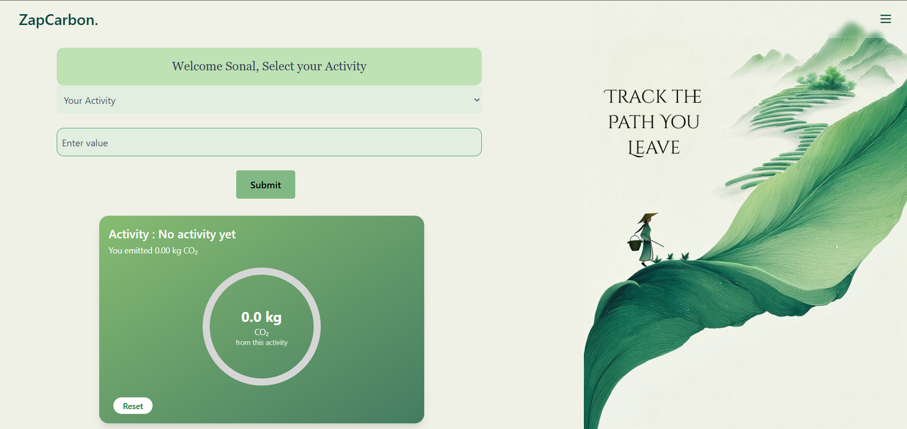
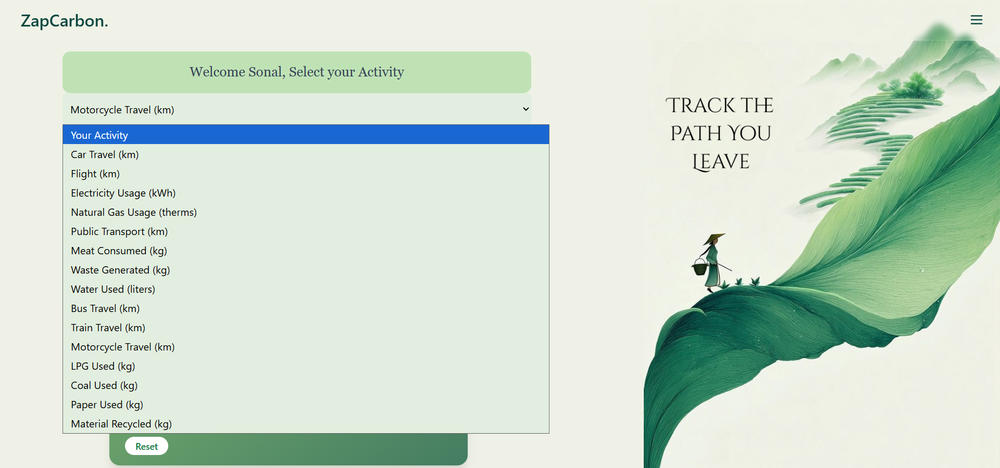
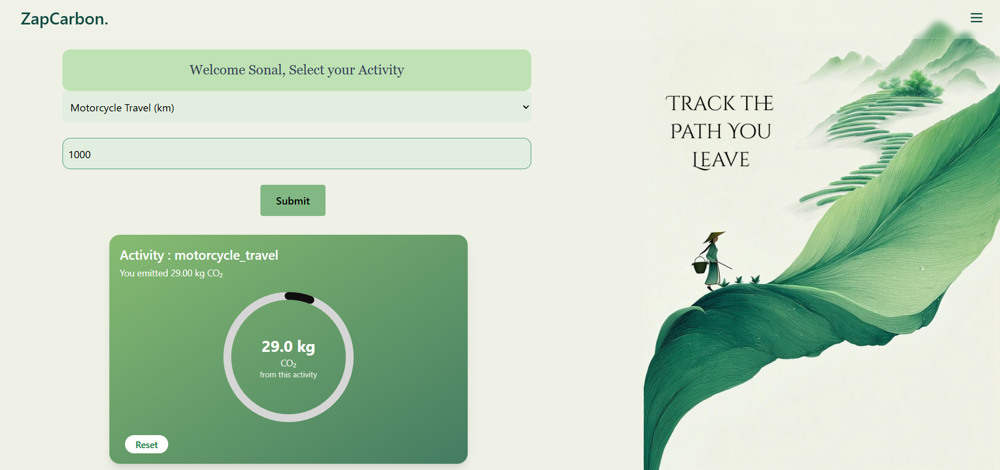
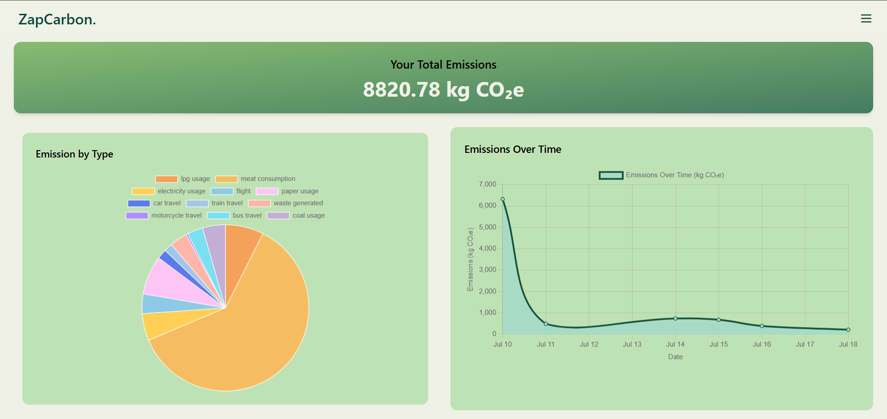
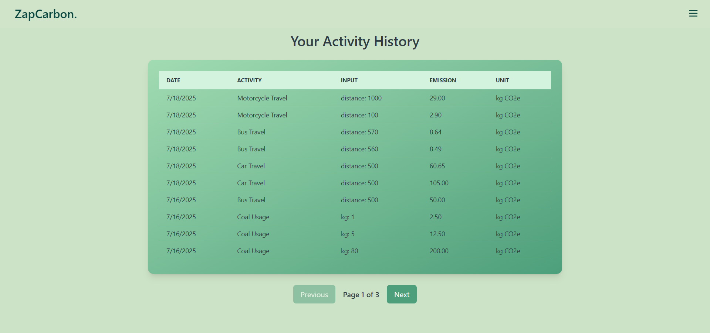
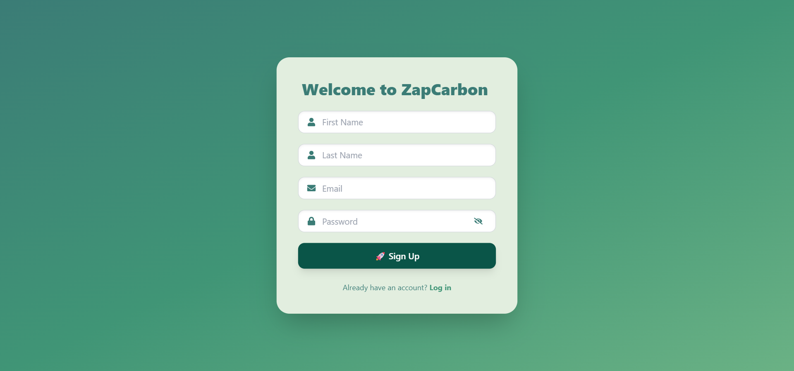

<h1 align="center">
  
  <br>
  ZapCarbon – Track the Path You Leave
</h1>


[](https://zap-carbon-ui.vercel.app/)

---

## 🛠️ Tech Stack

Frontend: React (Vite) + Tailwind CSS  
Backend: Node.js + Express  
Database: MongoDB Atlas 
Deployment: Vercel (Frontend) & Render (Backend)

---

ZapCarbon is a **MERN Stack carbon footprint tracker** that helps individuals monitor and reduce their **CO₂ emissions**.  
It allows users to **log activities, calculate emissions using Indian government (CEA) factors, track totals visually, and analyze patterns over time**.  

---

## ✨ Why ZapCarbon?

- **Real-world Impact** – Encourages eco-conscious living by quantifying your environmental footprint.  
- **Accurate Data** – Emission calculations are based on data from the Central Electricity Authority (CEA) and the Ministry of Environment, Forest and Climate Change (MoEFCC), Government of India.  
- **Clean UI + Engaging Analytics** – Interactive charts, history logs, and responsive design make it user-friendly.  
- **Scalable MERN Architecture** – Built for production deployment and portfolio-ready.

---

## 🚀 Live Demo  
👉 [**ZapCarbon is Live Here**](https://zap-carbon-ui.vercel.app/)

---

## 🔥 Key Features

- **Authentication (JWT + Cookies)**  
  - Secure login and signup system.

- **Activity Tracking (15 Choices)**  
  - Log activities like *Car Travel, Flights, LPG, Coal, Water, Meat, Paper, Public Transport,* etc.
  - Enter amount (km, kg, kWh) → See **CO₂ emission instantly**.

- **Interactive Dashboard**  
  - View individual emissions per activity.
  - Get **real-time results** using CEA and MoEFCC-backed emission factors.

- **Analytics Summary Page**  
  - **Pie Chart:** Emission breakdown by activity.  
  - **Line Chart:** Emission trends over time.  
  - **Total Emissions Counter**.

- **Activity History (Paginated)**  
  - Complete record of all activities with:
    - Date  
    - Activity Type  
    - Input Value  
    - Emission (kg CO₂e)

- **Fully Responsive & Minimalist UI**  
  - Powered by Tailwind CSS with soft color palettes for a clean look.

---

## 🖼️ Screenshots

### Dashboard (Main)


### Activity Selection


### Emission Result


### Summary Page


### Activity History


### Authentication - Login


### Authentication - Signup

---

## 🛠️ Tech Stack

### **Frontend**
- React (Vite)
- Tailwind CSS  
- Chart.js (for Pie and Line Charts)

### **Backend**
- Node.js  
- Express.js  
- JWT for authentication (with cookies)

### **Database**
- MongoDB Atlas (Cloud)

### **Deployment**
- **Frontend:** Vercel  
- **Backend:** Render  

---
## Installation & Setup

### 1. Clone the Frontend (UI)

```bash
git clone https://github.com/deft-n-dusk/ZapCarbon_UI.git
cd ZapCarbon_UI

# Install frontend dependencies
npm install

# Run frontend (Vite)
npm run dev
```

### 2. Clone the Backend

```bash
git clone https://github.com/deft-n-dusk/ZapCarbon_BE.git

# Install backend dependencies
npm install

# Start backend server
npm run dev
```
